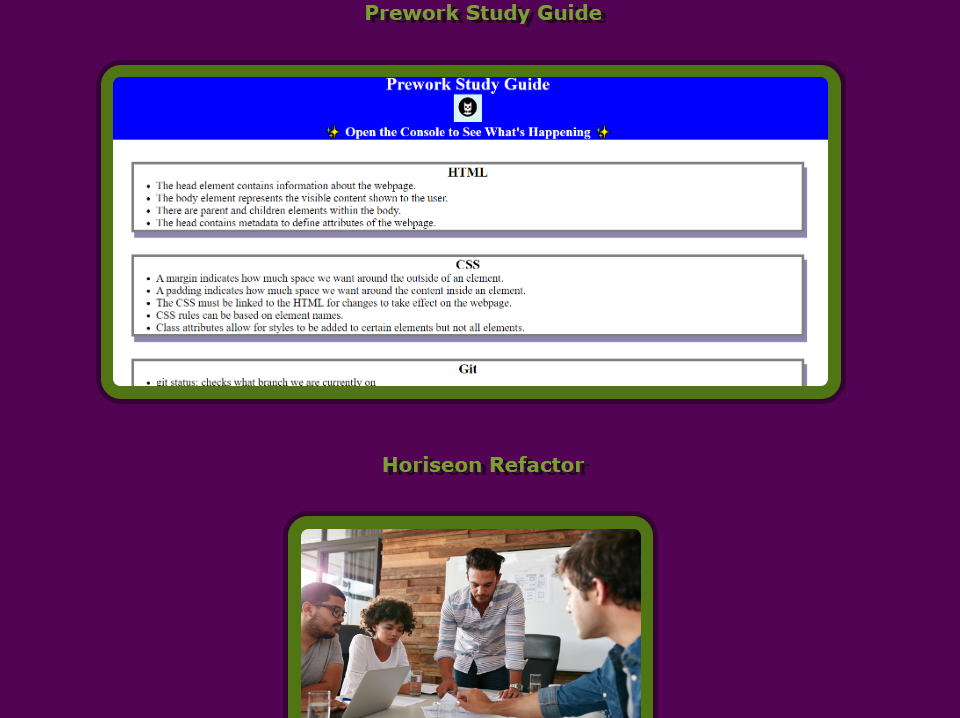
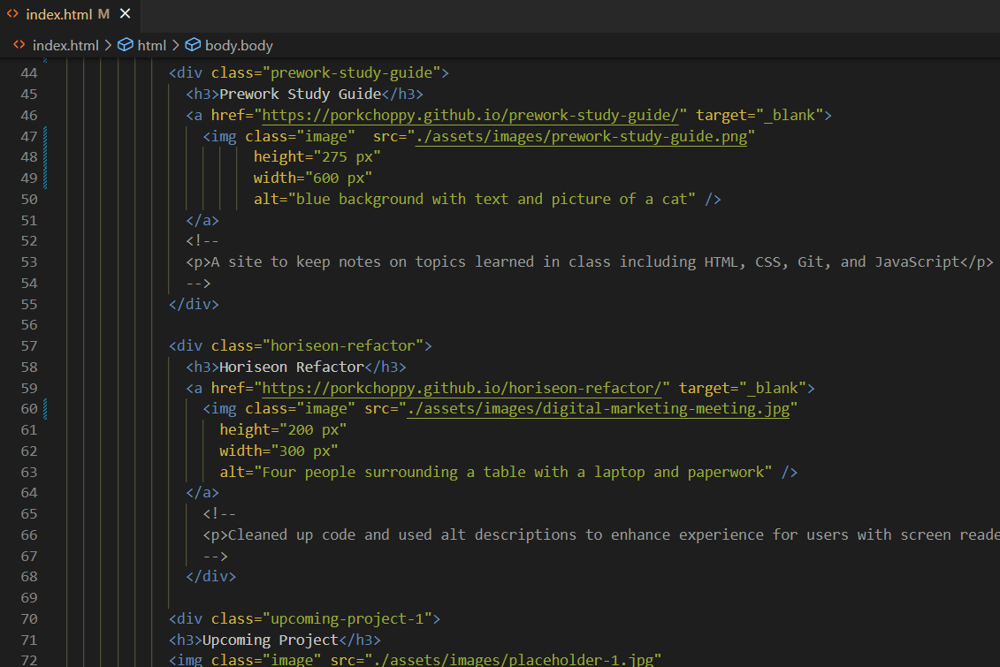
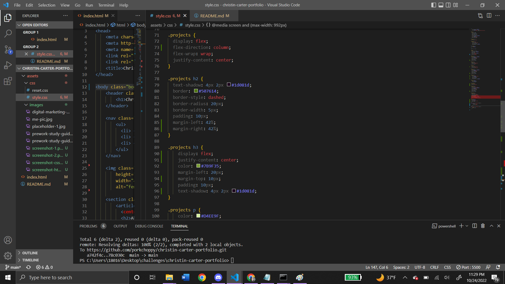

# Christin-Carter-Portfolio

## Description

This repository contains my portfolio, demonstrating the projects I have undertaken for the duration of the web dev bootcamp, while also showcasing knowledge of HTML and CSS. I learned how to maintain HTML and CSS that flow and make sense, and I also learned a lot about googling for references to certain aspects of the project that I wished to execute. I was able to put together a color palette that I enjoy but also that is complementary throughout the site. 

## Usage

Here you can see the projects being displayed on the site itself. 

Along with the accompanying HTML and CSS for that section of the site. 

## Credits

I received collaborative brainstorming and help from several classmates including Dylan Casbona, Alexa Lester, and Artie Cann. 

## Link to live site

https://porkchoppy.github.io/christin-carter-portfolio